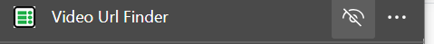
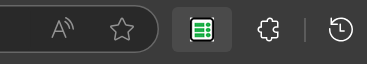
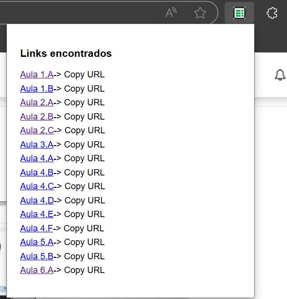

# VideoUrlFinder Extension

**VideoUrlFinder** is an extension currently under development for Microsoft Edge. Its purpose is to help users retrieve specific video URLs, but currently only supports videos from Start Program.

## Requirements

- **Microsoft Edge** (latest version recommended)
- **Internet access**

## Resources
- Javascript
- HTML

## Features

- Retrieves specific video URLs from web pages.
- Lightweight and easy-to-use interface.

## Installation Guide

To install **VideoUrlFinder** in Microsoft Edge, follow the steps below:


### 1. Prepare the Extension Folder
Clone the repository to your local machine and locate the extension's **`src`** folder, which contains the necessary files for the extension.
```bash
git clone https://github.com/your-username/VideoUrlFinder.git
```

### 2. Open Microsoft Edge
Launch **Microsoft Edge** on your computer.

### 3. Access the Extensions Page
- Click on the **three-dot menu** (ellipsis) in the top-right corner of the browser.
- Select **Extensions** from the dropdown menu.

Alternatively, you can enter `edge://extensions` in the address bar and press **Enter**.

### 4. Enable Developer Mode
On the Extensions page:
- Toggle the **Developer Mode** switch located in the bottom-left corner.

This allows you to install extensions that are not packaged.

### 5. Load the Unpacked Extension
- Click on the **Load unpacked** button.
- In the file explorer window that opens, navigate to the **`src`** folder containing your extension files.
- Select the folder and click **Select Folder**.

### 6. Verify the Extension
Once the extension is loaded, you should see it listed on the Extensions page. You can now start using the extension to retrieve video URLs.

### 7. Retrieve links
- After sucessfully installing the extension, go to Start Program webpage that displays the desired videos.

### 8. Enable the Extension
1. **Extension Menu on Toolbar:"**
    - On the Edge's Toolbar, click on Extesions icoon to open the extensions list.
    
2. **Display the extension on Toolbar:**
    -  In the extensions list, click on the "eye icon" next to the extension to make it visible on Edge's toolbar. 
    
    
3. ** Open the Extension **
    - Click on the extension icon in the toolbar to open the extension popup with a list of links.
    
    


## Development & Contributing

This extension is under active development. Contributions are welcome! Feel free to fork the repository, submit issues, or propose improvements.

## License

This project is licensed under the MIT License - see the [LICENSE](LICENSE) file for details.
